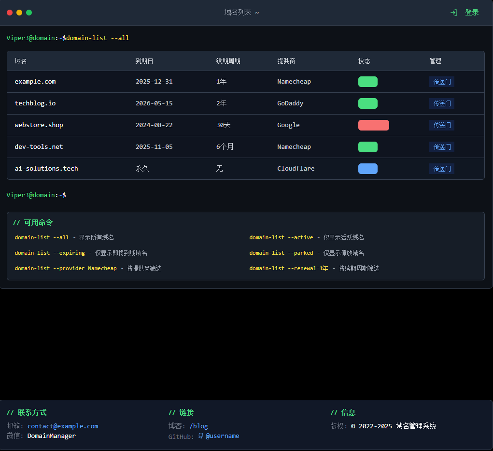

# 🚀 OneDomain

一个基于 Next.js 的现代化域名管理应用，使用最新的 React 19 和 TypeScript 构建。帮助用户集中管理和监控多个域名，提供到期提醒、续费管理等功能。支持多种域名提供商，提供统一的域名管理界面。



## 🛠️ 技术栈

- **框架**: Next.js 15.2.4
  - App Router
  - 服务器组件
  - 并行渲染
- **UI 组件**: shadcn/ui
  - 可访问性支持
  - 主题定制
  - 响应式设计
- **样式**: Tailwind CSS
  - 原子化 CSS
  - 深色模式支持
  - 自定义主题
- **状态管理**: React Hooks
  - 自定义 Hooks
  - 状态持久化
- **表单处理**: React Hook Form
  - 表单验证
  - 错误处理
- **类型检查**: TypeScript
  - 严格模式
  - 类型安全
- **包管理**: pnpm
  - 快速安装
  - 依赖管理
- **图标**: Lucide React
  - 矢量图标
  - 主题适配
- **动画**: Tailwind CSS Animate
  - 过渡效果
  - 交互反馈
- **工具库**: 
  - date-fns: 日期处理
  - recharts: 数据可视化
  - sonner: 通知系统
  - zod: 数据验证

## 📁 项目结构

```
OneDomain/
├── app/                    # Next.js 应用目录
│   ├── api/               # API 路由
│   ├── admin/            # 管理后台
│   ├── ui/               # UI 页面
│   ├── globals.css       # 全局样式
│   ├── layout.tsx        # 根布局组件
│   └── page.tsx          # 主页面
├── components/           # 组件目录
│   ├── admin/           # 管理组件
│   ├── ui/              # UI 组件
│   ├── command-examples.tsx  # 命令示例
│   ├── command-input.tsx     # 命令输入
│   ├── domain-table.tsx      # 域名表格
│   ├── footer.tsx            # 页脚
│   ├── profile-info.tsx      # 用户信息
│   ├── terminal.tsx          # 终端界面
│   └── theme-provider.tsx    # 主题提供者
├── hooks/                # 自定义 Hooks
│   ├── use-mobile.tsx   # 移动端检测
│   └── use-toast.ts     # 通知系统
├── lib/                  # 工具函数
│   └── utils.ts         # 通用工具
├── public/              # 静态资源
│   ├── placeholder-logo.png  # 占位 Logo
│   ├── placeholder-logo.svg  # 矢量 Logo
│   ├── placeholder-user.jpg  # 用户头像
│   ├── placeholder.jpg       # 通用占位图
│   └── placeholder.svg       # 通用矢量图
└── styles/              # 样式文件
    └── globals.css      # 全局样式
```

## ✨ 功能特性

### 🌐 域名管理
- 域名列表展示
  - 表格视图
  - 搜索过滤
  - 排序功能
  - 域名状态追踪
  - 状态实时更新
- 域名导入导出
  - 批量导入
    - 支持 JSON 格式
  - 批量导出
    - 导出模板下载
- 域名克隆
  - 快速复制域名配置
- 控制台快速访问
  - 一键跳转
  - 多平台支持
  - 登录状态保持

### 💻 命令行界面
- 命令输入
  - 智能提示
  - 命令补全
  - 历史记录
- 命令示例
  - 常用命令
  - 使用说明
  - 快捷操作

### 📝 TODO:
- [ ] 批量克隆功能
- [ ] 到期时间监控
- [ ] 到期提醒
- [ ] 剩余天数显示
- [ ] 批量续费提醒

## 🚀 开发环境设置

### 📋 前提条件

- Node.js (推荐 v18+)
- pnpm (推荐 v8+)
- Git

### 📥 安装步骤

1. 克隆仓库
```bash
git clone https://github.com/Viper373/OneDomain.git
cd OneDomain
```

2. 安装依赖（选择你的包管理器）

```bash
# pnpm
pnpm install
pnpm dev
pnpm build
pnpm start

# npm
npm install
npm run dev
npm run build
npm run start

# yarn
yarn install
yarn dev
yarn build
yarn start
```

3. 配置环境变量
创建 `.env.local` 文件并添加以下内容：
```env
# 管理员密码
ADMIN_PASSWORD=your_admin_password

# 可选：API 配置
API_URL=http://localhost:3000
```

## 🌐 部署到 Vercel

本项目可以一键部署到 Vercel 平台：

[](https://vercel.com/new/clone?repository-url=https://github.com/Viper373/OneDomain)

点击上面的按钮，按照以下步骤操作：

1. 登录或注册 Vercel 账号
2. 选择你的 GitHub 账号
3. 选择要部署的仓库
4. 配置环境变量：
   - `ADMIN_PASSWORD`: 管理员密码
   - `API_URL`: API 地址（可选）
5. 点击 "Deploy" 按钮

部署完成后，Vercel 会提供一个生产环境的 URL。每次推送到主分支时，Vercel 都会自动重新部署。

## 📊 域名数据管理

项目可以使用 `domains.json` 文件存储域名信息并在后台管理界面进行导入（无需逐个添加域名），更适配懒人：

### 字段说明

| 字段名 | 类型 | 示例值 | 说明 |
|--------|------|--------|------|
| name | string | "viper3.top" | 域名名称 |
| expiry | string | "2025-09-29" | 到期时间，永久域名留空 |
| renewalValue | number | 1 | 续费周期值 |
| renewalUnit | string | "年" | 续费周期单位（年/月/天） |
| provider | string | "Tencent Cloud" | 域名提供商 |
| consoleUrl | string | "https://console.cloud.tencent.com/domain/all-domain/all" | 控制台链接 |
| status | string | "活跃" | 域名状态 |
| isPermanent | boolean | false | 是否永久域名 |

### 示例数据

```json
{
  "domains": [
    {
      "name": "viper3.top",
      "expiry": "2025-09-29",
      "renewalValue": 1,
      "renewalUnit": "年",
      "provider": "Tencent Cloud",
      "consoleUrl": "https://console.cloud.tencent.com/domain/all-domain/all",
      "status": "活跃",
      "isPermanent": false
    },
    {
      "name": "viper3.ip-ddns.com",
      "expiry": "",
      "renewalValue": 2,
      "renewalUnit": "年",
      "provider": "CloudDNS",
      "consoleUrl": "https://www.cloudns.net/records/domain",
      "status": "停放",
      "isPermanent": true
    }
  ]
}
```

## ⚙️ 配置说明

### Next.js 配置

项目使用 Next.js 15.2.4，配置了以下特性：
- 并行服务器构建
- 并行服务器编译
- 优化的 Webpack 构建
- 图片优化
- TypeScript 和 ESLint 配置

### Tailwind CSS 配置

使用 Tailwind CSS 进行样式管理，配置了：
- 自定义颜色系统
- 响应式设计
- 动画效果
- 主题变量

### TypeScript 配置

项目使用严格的 TypeScript 配置：
- ES6 目标
- 模块解析
- 路径别名
- 类型检查

## 🤝 贡献指南

1. Fork 项目
2. 创建特性分支 (`git checkout -b feature/AmazingFeature`)
3. 提交更改 (`git commit -m 'Add some AmazingFeature'`)
4. 推送到分支 (`git push origin feature/AmazingFeature`)
5. 开启 Pull Request

## 📄 许可证

本项目采用 MIT 许可证 - 详情请参阅 [LICENSE](LICENSE) 文件。

## 📧 联系方式

如有任何问题或建议，请通过以下方式联系：

- 项目 Issues
- 电子邮件：[2483523414@qq.com]

## 🙏 致谢

- v0.dev（提供免费前端代码生成额度）
- 所有域名服务提供商